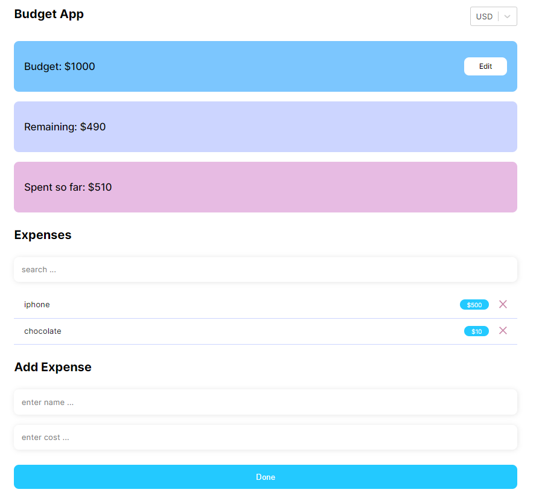

<div id="top"></div>

<!-- PROJECT LOGO -->
<br />
<div align="center">
  <a href="https://github.com/OlgaUsovich/react-budget-app">
    
  </a>

<h3 align="center">Budget App</h3>

  <p align="center">
    React app. Studying work
  </p>
</div>

<br>

<!-- ABOUT THE PROJECT -->
## About The Project



### Built With

* [React](https://ru.reactjs.org/)
* [React Select](https://react-select.com/home)
* [React Hook Form](https://react-hook-form.com/)
* [Styled Components](https://styled-components.com/)
* [Node.js](https://nodejs.org/en/)

<!-- GETTING STARTED -->
### Launch the project

1. Clone the repo
   ```sh
   git clone https://github.com/OlgaUsovich/react-budget-app.git
   ```
2. Install NPM packages
   ```sh
   npm install
   ```
3. Run project
   ```sh
   npm start
   ```
## Contact

Olga Usovich - [@linkedin](https://www.linkedin.com/in/volha-usovich-758119205) - olya.usovich.17@mail.ru

Project Link: [https://github.com/OlgaUsovich/react-budget-app.git](https://github.com/OlgaUsovich/react-budget-app.git)
